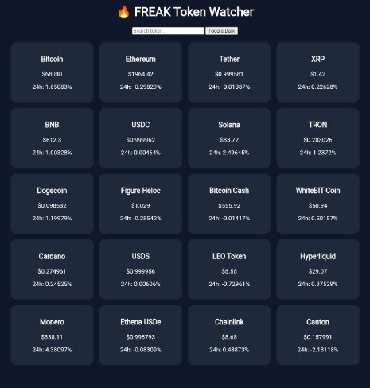

TRAC ADDRESS : 
trac1m0yr05s03upqqdnxmr6hutkpqj9lsyldhf9cx9hcvvzuznweexvsjfjmyq

🔥 FREAK Token Watcher

A modern, lightweight, and open-source cryptocurrency token watcher built with Node.js and Express.

Real-time crypto price monitoring with a clean UI and production-ready backend architecture.

🌍 About The Project

FREAK Token Watcher is an open-source full-stack web application that displays real-time cryptocurrency prices using the CoinGecko API.

This project is designed for:

Developers learning full-stack JavaScript

Open-source contributors

Portfolio projects

Lightweight crypto dashboards

Termux / Linux users

✨ Features

🔥 Live Top 20 cryptocurrencies (by market cap)

🔎 Real-time search filter

🌙 Dark / Light mode toggle

🔄 Auto refresh every 30 seconds

📱 Responsive grid layout

⚡ Backend caching for performance

🔐 Production-ready security middleware

🧱 Clean and scalable folder structure

📸 Proof of Work

Application running successfully:

🛠 Tech Stack

Node.js

Express.js

Axios

CoinGecko API

HTML5

CSS3

Vanilla JavaScript

📦 Installation

1️⃣ Clone Repository

git clone https://github.com/freak-max/freak-token-watcher.git
cd freak-token-watcher

2️⃣ Install Dependencies

npm install

3️⃣ Run Application

npm start

📁 Project Structure

freak-token-watcher/
│
├── src/
│   ├── server.js
│   ├── routes/
│   ├── services/
│   └── middleware/
│
├── public/
│   ├── index.html
│   ├── style.css
│   ├── script.js
│   └── proof-of-work.png
│
├── .env.example
├── package.json
└── README.md

🔌 API Endpoint

GET /api/crypto

Returns top 20 crypto assets by market capitalization.

